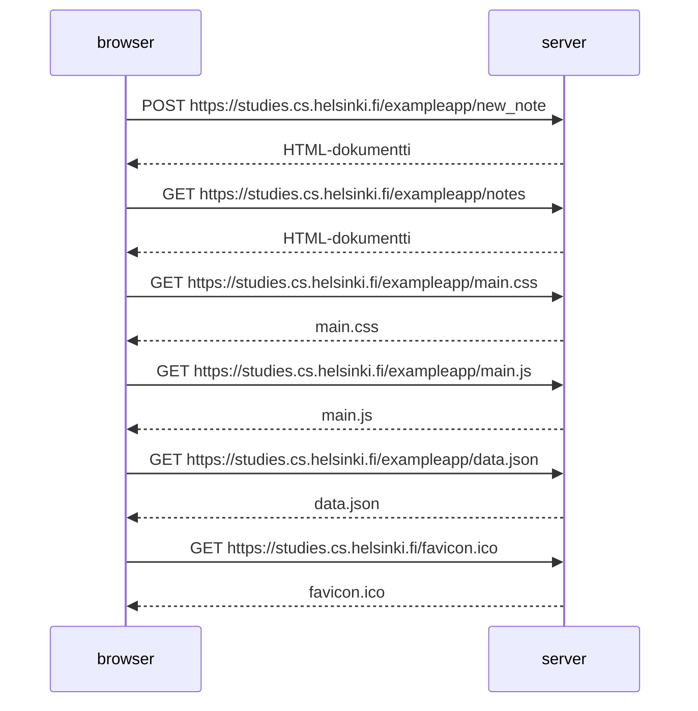

```mermaid
   sequenceDiagram
    participant browser
    participant server

    browser->>server: POST https://studies.cs.helsinki.fi/exampleapp/new_note
    server-->>browser: HTML-dokumentti

    browser->>server: GET https://studies.cs.helsinki.fi/exampleapp/notes
    server-->>browser: HTML-dokumentti
    
    browser->>server: GET https://studies.cs.helsinki.fi/exampleapp/main.css
    server-->>browser: main.css
    
    browser->>server: GET https://studies.cs.helsinki.fi/exampleapp/main.js
    server-->>browser: main.js
    
    browser->>server: GET https://studies.cs.helsinki.fi/exampleapp/data.json
    server-->>browser: data.json
    
    browser->>server: GET https://studies.cs.helsinki.fi/favicon.ico
    server-->>browser: favicon.ico
```
